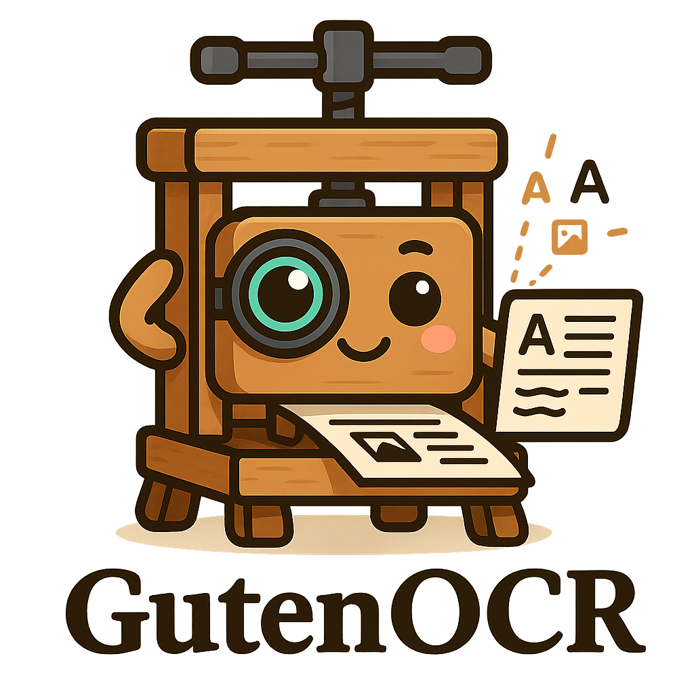
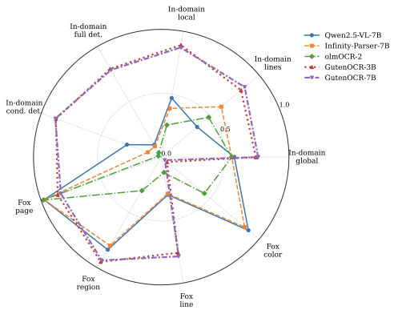

<p align="center">
  
</p>

<h1 align="center">GutenOCR</h1>

<p align="center">
  <strong>Open-source tools for training and evaluating Vision Language Models for OCR</strong>
</p>

<p align="center">
  <a href="https://opensource.org/licenses/Apache-2.0"></a>
  <a href="https://huggingface.co/collections/GutenOCR"></a>
  <a href="#citation"></a>
</p>

* * *

## Overview

GutenOCR provides a complete toolkit for building OCR systems powered by Vision Language Models (VLMs).

<p align="center">
  
</p>

### What's Inside

| Component                             | Description                                       |
| ------------------------------------- | ------------------------------------------------- |
| **[Data Pipelines](#data-pipelines)** | Data utilities for 6+ document sources            |
| **[Multi-GPU Training](#training)**   | Full-weight VLM fine-tuning with DeepSpeed ZeRO-3 |
| **[vLLM Evaluation](#evaluation)**    | OCR benchmarking framework                        |

* * *

## Data Pipelines

Standardized data processing pipelines that output a unified format with bounding boxes and text at word, line, and paragraph levels.

| Pipeline                                           | Source            | Description                                              |
| -------------------------------------------------- | ----------------- | -------------------------------------------------------- |
| [**Google Vision OCR**](data/google_vision_ocr/)   | Cloud API         | Text/document/PDF modes with polygon coordinates         |
| [**Grounded LaTeX**](data/grounded_latex/)         | LaTeX sources     | Math equations with rotation variants & bbox annotations |
| [**IDL**](data/idl/)                               | Industry docs     | Industry Document Library standardization                |
| [**PubMed**](data/pubmed/)                         | Scientific papers | ~2M paper processing with failure recovery               |
| [**SynthDoG Grounding**](data/synthdog_grounding/) | Synthetic         | Multi-language doc generation (EN/ZH/JA/KO), text+bbox   |
| [**TabMe++**](data/tabmepp/)                       | Industry docs     | Azure-based OCR                                          |

All pipelines output **WebDataset tar shards** with standardized JSON:

```json
{
  "text": {
    "lines": [{"text": "Hello world", "bbox": [x1, y1, x2, y2]}],
    "text": "Full document text",
    "text2d": "Layout-preserved\ntext rendering"
  },
  "image": {"width": 1000, "height": 1400}
}
```

* * *

## Training

Full-weight fine-tuning of Vision Language Models with multi-GPU support.

**Location:** [`experiments/qwen-multigpu-sft/`](experiments/qwen-multigpu-sft/)

### Features

-   **DeepSpeed ZeRO-3** optimization for memory-efficient training
-   **WebDataset streaming** for large-scale data handling  
-   **Flexible task system** via CSV configuration
-   **Checkpoint resume** with model-only loading option

### Supported Tasks

| Task                    | Description                                                   |
| ----------------------- | ------------------------------------------------------------- |
| `reading`               | Full document OCR (text, text2d, lines+bbox, paragraphs+bbox) |
| `detection`             | Locate text regions without transcription                     |
| `localized_reading`     | Read text within a specified bounding box                     |
| `conditional_detection` | Find bounding boxes for given text queries                    |

### Quick Start

```bash
cd experiments/qwen-multigpu-sft

# Install dependencies
uv sync
uv pip install flash-attn --no-build-isolation

# Launch training (8 GPUs)
accelerate launch --config_file acc.yaml sft_clean.py \
    --train-shards "path/to/train/*.tar" \
    --val-shards "path/to/val/*.tar" \
    --output-dir ./checkpoints
```

* * *

## Evaluation

Batch OCR evaluation using vLLM for fast inference across multiple GPUs.

| Framework                                       | Description                                                                   |
| ----------------------------------------------- | ----------------------------------------------------------------------------- |
| [**vLLM OCR Eval**](experiments/vllm-ocr-eval/) | General OCR benchmarking (CER, WER, detection)                                |
| [**vLLM Fox**](experiments/vllm-fox/)           | [Fox benchmark](https://github.com/ucaslcl/Fox) for fine-grained document OCR |

**Location:** [`experiments/vllm-ocr-eval/`](experiments/vllm-ocr-eval/)

### Metrics

| Category         | Metrics                                |
| ---------------- | -------------------------------------- |
| **Text Quality** | CER, WER, ANLS, Exact Match            |
| **Detection**    | Precision, Recall, F1 @ IoU thresholds |
| **Structured**   | Combined bbox + text matching          |

### Quick Start

```bash
cd experiments/vllm-ocr-eval

# Generate predictions
uv run python run_evaluation.py \
    --model-name "Qwen/Qwen2.5-VL-7B-Instruct" \
    --shard-path data.tar \
    --task-types reading \
    --output-types text \
    --csv-output predictions.csv

# Score results
uv run python score_text_reading.py predictions.csv
```

### Multi-GPU Evaluation

```bash
uv run python run_evaluation.py \
    --num-workers 4 \
    --shard-path "data/*.tar" \
    ...
```

* * *

## Installation

Each component has its own dependencies. We recommend using [uv](https://github.com/astral-sh/uv) for fast, reliable Python package management.

```bash
# Clone the repository
git clone https://github.com/your-org/GutenOCR.git
cd GutenOCR

# Install component-specific dependencies
cd experiments/qwen-multigpu-sft && uv sync
cd experiments/vllm-ocr-eval && uv sync
```

* * *

## Citation

```bibtex
@misc{heidenreich2025gutenocr,
  title         = {GutenOCR: A Grounded Vision--Language Front-End for Documents},
  author        = {Heidenreich, Hunter and Elliott, Ben and Dinica, Olivia and Getachew, Yosheb},
  year          = {2025},
  eprint        = {XXXXX.XXXXX},        % <-- arXiv ID
  archivePrefix = {arXiv},
  primaryClass  = {cs.CV},              % or cs.CL / cs.IR as appropriate
  version       = {vX},                 % <-- arXiv version when available
  url           = {https://arxiv.org/abs/XXXXX.XXXXX},
  note          = {Preprint}
}

@misc{heidenreich2025pubmedocr,
  title         = {PubMed-OCR: PMC Open Access OCR Annotations},
  author        = {Heidenreich, Hunter and Getachew, Yosheb and Dinica, Olivia and Elliott, Ben},
  year          = {2025},
  eprint        = {XXXXX.XXXXX},        % <-- arXiv ID
  archivePrefix = {arXiv},
  primaryClass  = {cs.CV},              % or cs.CL / cs.IR as appropriate
  version       = {vX},                 % <-- arXiv version when available
  url           = {https://arxiv.org/abs/XXXXX.XXXXX},
  note          = {Preprint}
}
```

_Paper coming soon on arXiv._

* * *

## Acknowledgments

-   [SynthDoG](https://github.com/clovaai/donut/tree/master/synthdog) from NAVER Corp (MIT License) --- basis for our synthetic document generation
-   Built with [Qwen2.5-VL](https://github.com/QwenLM/Qwen2.5-VL), [vLLM](https://github.com/vllm-project/vllm), [DeepSpeed](https://github.com/microsoft/DeepSpeed)

* * *

## License

This project is licensed under the [Apache License 2.0](LICENSE).

* * *

<p align="center">
  <strong>Built with ❤️ for the open-source community</strong>
</p>
